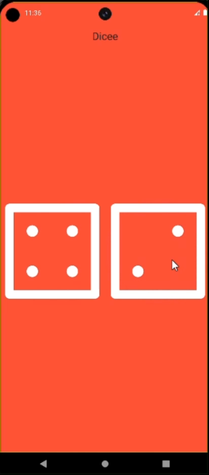
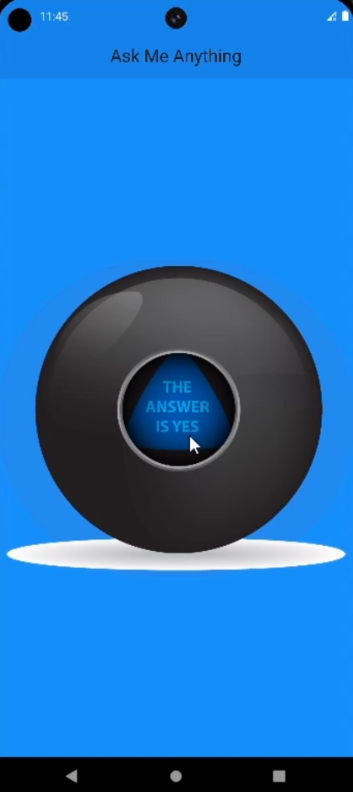
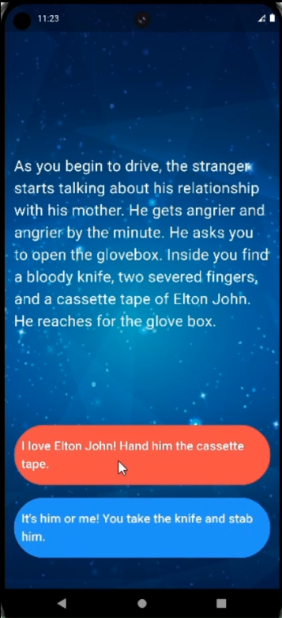

# flutter_course_projects

A collection of Flutter apps built during Angela Yu's Flutter course. This repository includes various projects that demonstrate different Flutter functionalities and concepts, including a digital business card, a xylophone, Magic 8 Ball, dice roller, to-do list app, quiz app, interactive story app, BMI calculator, weather app, and chat app.

## Projects

### Mi Card

A digital business card app that displays personal information.


---

### Dicee

A dice rolling app that simulates rolling dice.



---

### Magic 8 Ball

An app that provides random answers to user questions, simulating a Magic 8 Ball.



---

### Quizzler

A quiz app that presents multiple-choice questions and tracks scores.


---

### Destini

An interactive story app that allows users to make choices that affect the narrative.



---

### BMI Calculator

A body mass index calculator that computes BMI based on user input.

.png>)
.png>)

---

### Clima Flutter Weather App

A weather application that provides current weather information based on user location.

.png>)
.png>)

---

### Todoey

A to-do list app that allows users to add and manage tasks.

.png>)
.png>)

---

### Flash Chat

A real-time chat application using Firebase.

.png>)
.png>)
.png>)

---

## Getting Started

To get a local copy up and running, follow these steps:

1. **Clone the repository:**
   ```bash
   git clone https://github.com/Abdur-Rehman-643/flutter_course_projects.git
   ```
2. **Navigate to the project directory:**
   ```bash
   cd flutter_course_projects
   ```
3. **Install dependencies:**
   ```bash
   flutter pub get
   ```
4. **Run the app:**
   ```bash
   flutter run
   ```
